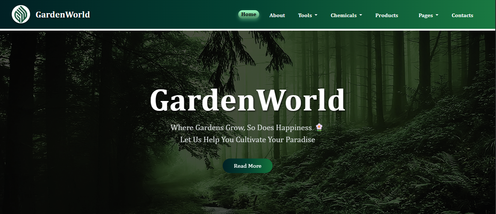

# GardenWorld

 

GardenWorld is a beginner-friendly web application designed to empower aspiring gardeners with expert tips, guides, and techniques for successful gardening. Drawing from over 40 years of hands-on experience, this project provides accessible, no-cost resources to help users cultivate thriving gardens—regardless of prior knowledge. Whether you're starting with composting or exploring raised bed setups, GardenWorld makes sustainable gardening simple, rewarding, and eco-friendly.

## Features

- **Comprehensive Gardening Guides**: Detailed overviews of essential techniques to build your knowledge base.
- **Beginner-Accessible Content**: No prior experience required—everything is explained in plain, actionable language.
- **Eco-Conscious Practices**: Focus on natural, chemical-free methods to promote healthy plants and a sustainable environment.
- **Interactive Navigation**: Easy-to-use links to dive deeper into topics, with visual icons for quick scanning.
- **Inspirational Metrics**: Track your progress with fun placeholders for achievements like "Happy Clients" and "Gardens Completed."

Key techniques covered include:
- **Composting**: Turn kitchen scraps into nutrient-rich soil to boost fertility and cut down on waste.
- **Mulching**: Use organic layers to lock in moisture, control temperature, and keep weeds at bay.
- **Propagation**: Multiply your plants affordably through cuttings, seeds, or divisions.
- **Seed Saving**: Harvest and store seeds from favorites like tomatoes, peppers, and herbs for future seasons.
- **Natural Pest Control**: Deploy safe solutions like neem oil, garlic sprays, or ladybugs to protect your garden.
- **Raised Bed Gardening**: Elevate your setup with framed beds for better drainage and easier maintenance.

## Live Demo

Check out the fully deployed app:  
[https://garden-world-project.vercel.app/main.html](https://garden-world-project.vercel.app/main.html)

Explore the techniques, read guides, and get inspired to start your own garden today!

## Tech Stack

- **Frontend**: HTML5, CSS3 (with responsive design for mobile and desktop).
- **Styling**: Custom CSS for clean, emoji-enhanced visuals.
- **Deployment**: Vercel for seamless hosting and global access.
- **Version Control**: Git and GitHub for collaborative development.

This project is built with simplicity in mind, ensuring fast load times and broad browser compatibility.

## Installation & Setup

To run GardenWorld locally:

1. **Clone the Repository**:
   ```
   git clone https://github.com/AfeerKhan/GardenWorld.git
   cd GardenWorld
   ```

2. **Open in Your Browser**:
   - Simply open `main.html` (or the root index file) in any modern web browser like Chrome, Firefox, or Safari.
   - No build tools or servers required—it's a static site!

3. **Optional: Edit Content**:
   - Modify HTML files to add new guides or update techniques.
   - Tweak CSS for custom styling.

If you're contributing, ensure changes align with the project's focus on accessibility and sustainability.

## Usage

- Navigate to the live demo or local files.
- Click on technique icons (e.g., composting) to "Read More" and access detailed info.
- Use the "Explore More" section for broader insights.
- Bookmark your favorite guides and start applying them in your garden!

## Contributing

GardenWorld is open-source and welcomes contributions! Whether it's adding new techniques, improving accessibility, or fixing bugs:

1. Fork the repo.
2. Create a feature branch (`git checkout -b feature/amazing-gardening-tip`).
3. Commit your changes (`git commit -m "Add new propagation guide"`).
4. Push to the branch (`git push origin feature/amazing-gardening-tip`).
5. Open a Pull Request.

Please adhere to our simple guidelines: Keep content beginner-friendly, cite sources for new info, and test across devices.

## License

This project is licensed under the MIT License - see the [LICENSE](LICENSE) file for details. (If no LICENSE file exists, feel free to add one!)

## Acknowledgments

- Inspired by decades of real-world gardening passion.
- Built with love for nature and community.
- Thanks to Vercel for effortless deployment.

## Contact

For questions, suggestions, or collaborations:  
- **Developer**: Afeer Khan  
- **GitHub**: [@AfeerKhan](https://github.com/AfeerKhan)  
- **Demo Feedback**: Try the live site and share your thoughts!

Happy gardening! 🌱✨

---

*Last updated: November 29, 2025*
